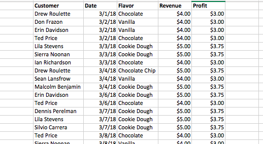
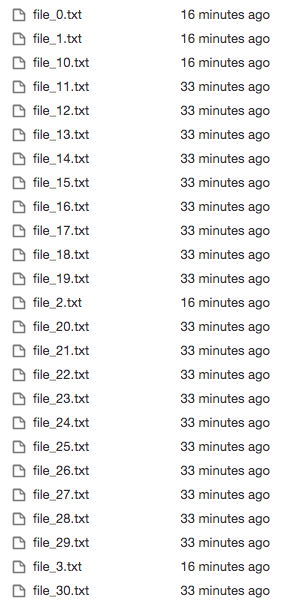

# convert_excel_to_text_files
#### Used the package xlrd in python to convert the data in excel cells to separated txt files. First import the xlrd package in the python. 
```
import xlrd
```
#### The raw data in excel look like this, only need to output the first 11 customers in the separate txt files.


#### Loop the second col in the excel file and output each data in the excel cells to a new txt files, limit the range to 20 and ouput first 11 rows in the second col in the excel file into txt files.
```
i = 1
for i in range(0,20):
    workbook = xlrd.open_workbook('/Users/biyichen/Desktop/IceCreamDataSet.xlsx')
    sheet = workbook.sheets()[0]
    content = sheet.col_values(1)[i]
    filename = 'file_{}.txt'.format(i)
    with open(filename, 'w', encoding='utf-8') as f:
        f.write(content)
        i+=1;
    if i == 11:
        break
    else:
        continue
  ```
#### The output txt files will be saved in the same path where you stored the script.

